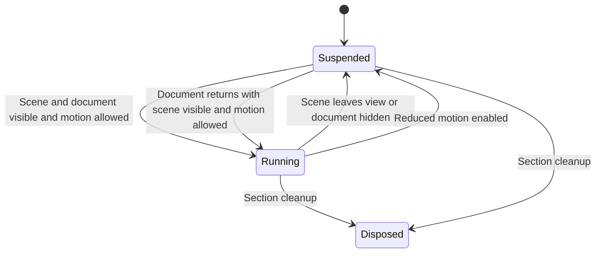

# Homepage Performance Optimizations - Plan

## Goal Capsule

- **Objective:** Visitors download fewer unnecessary assets and spend less device power on invisible motion, while retaining the portfolio's visual quality.
- **Means:** Apply the four optimizations identified in the preceding audit: offscreen motion suspension, conditional lightbox loading, font-kit correction, and responsive gallery images.
- **Authority:** The user's request and project instructions govern execution. `DESIGN.md` governs visual and motion choices; document conflicts before changing them.
- **Execution:** This document authorizes planning only. A later implementation pass can work through U1–U4 independently, with U3's external font dependency isolated.
- **Completion ownership:** The implementer records verification and remaining dependencies. Production deployment requires a separate request. An unavailable Adobe kit blocks completion of U3, not the other units.

## Product Contract

### Summary

Reduce unnecessary homepage downloads and offscreen animation work. Keep existing navigation, gallery behavior, and the intended typography and motion design.

### Problem Frame

The audit found measurable waste in the current production build and live homepage:

- Initial homepage JavaScript totals 86,761 bytes gzip. GLightbox accounts for 15,580 bytes gzip plus roughly 2,550 bytes of CSS, although all four featured cards link to detail pages and there are no `.glightbox-video` cards.
- At the footer, the background video's playback time advanced by about 1.2 seconds over a 1.2-second sample, roughly 7,500 pixels above the viewport. The marquee transform also kept changing. The foreground video was paused in this sample; do not claim both were observed playing offscreen.
- `index.html` loads two Adobe kits. `bnp0hyp` serves Franklin Gothic and Nicholas; `gya6int` serves IvyPresto Display 300 and unrelated families. Neither supplies Aktiv Grotesk. This contradicts `DESIGN.md`, which describes IvyPresto and Aktiv as supplied by `bnp0hyp`.
- Gallery markup serves one image per card. Wyatt's 1080×1350 poster is 397,826 bytes; its existing 400×500 thumbnail is 31,252 bytes. The smaller file is a candidate, not a promise of equal quality or universal savings on high-density screens.

These are audit measurements, not Core Web Vitals or battery benchmarks. Production ordering differed from the local content data, so implementation must capture its own baseline from the exact revision being changed.

### Requirements

**Playback and interaction**

- R1. Suspend the hero's decorative video playback and marquee movement while the scene is outside the visible page, and resume appropriately when it returns.
- R2. Pages without lightbox cards must not download GLightbox JS or CSS; pages with those cards must retain existing playback and player keyboard controls.

**Fonts and images**

- R3. Remove unused homepage font-kit loading and supply the font families and weights required by `DESIGN.md`, resolving its current kit mismatch.
- R4. Serve gallery image candidates appropriate to display size and density, retaining sufficient resolution and the current crop.

### Acceptance Examples

- AE1. Covers R1: After scrolling to the footer and waiting for scroll smoothing to settle, hero video times and marquee position remain stable. Scrolling back restores eligible motion without replaying the entrance sequence.
- AE2. Covers R2: The current four-card homepage requests no GLightbox assets. A temporary lightbox-card fixture can still open, play, close, and restore its gallery preview.
- AE3. Covers R3: The homepage's declared Adobe faces include the intended families and used weights, and typography remains legible if the provider fails.
- AE4. Covers R4: Fresh small-screen sessions can select smaller eligible images; desktop and high-density sessions retain sharp images with no changed layout or crop.

## Planning Contract

### Key Technical Decisions

- KTD1. **Use section-owned ScrollTrigger lifecycle control.** Extend `gsap.context()` setup/cleanup in the existing hero and marquee modules. ScrollSmoother makes IntersectionObserver unsuitable here. Suspend rather than rewind, unload, or recreate media and timelines.
- KTD2. **Move the lightbox dependency behind the DOM eligibility check.** A static import downloads the dependency before the current early return. Use a conditional dynamic import for the JS and associated vendor CSS. Preserve the synchronous cleanup contract consumed by `src/main.js`, including disposal while the import is pending.
- KTD3. **Correct Adobe configuration before switching the homepage's kit.** Verify a replacement or corrected kit containing the intended families and used weights. Do not guess a kit ID or silently substitute a new typeface. Updating a shared Adobe web project can affect other consumers and requires explicit publishing authorization.
- KTD4. **Keep gallery content data-driven.** Extend the build-time gallery renderer with optional responsive-image metadata in `public/data/Projects.json`. Missing metadata keeps the existing `src` path working. Use real asset dimensions, not filename guesses.

### Assumptions

These implementation defaults have not been separately confirmed:

- This is a homepage-focused pass. Smoke-check shared consumers, but avoid a sitewide typography migration, hosting changes, video re-encoding, or unrelated cursor/ticker refactors.
- Existing visible animation timing, crop, layout, and gallery order remain the reference. Font loading should implement the intended design, with explicit visual review of changes from today's fallback rendering.
- Reuse existing tools and image variants before adding dependencies. Browser verification is the principal proof; do not introduce a test framework for these changes.
- Additional font weights may increase font bytes. Judge that unit by removal of unused loading and delivery of correct typography, not an invented total-byte reduction target.

### Motion lifecycle

Marquee hover can hold the marquee paused while the scene is otherwise eligible. Reduced-motion handling remains authoritative. Initial media readiness must continue to satisfy the preloader.

### Sequencing and dependencies

Implement U1, U2, then U4. Complete U3 when the verified Adobe kit is available. Each unit is a separate logical change with its own evidence. The font dependency does not prevent starting the other work.

## Implementation Units

### U1. Suspend offscreen hero motion

**Goal / requirements:** Remove invisible playback and animation work. Covers R1 / AE1 through KTD1.

**Files:** `src/sections/hero-aperture-dual.js`, `src/sections/hero-aperture-marquee.js`, `DESIGN.md`; inspect `src/main.js` and `src/components/preloader.js` for integration.

**Dependencies:** None.

**Approach:**

1. Add visibility control that accounts for the pinned scene's entire rendered presence, including the period after its pin ends while it scrolls out. Do not use the pin's active flag alone as viewport visibility.
2. Coordinate the background video's existing timeline `onStart` playback with the visibility controller so a refresh or scrub cannot restart offscreen playback.
3. Pause/resume the existing marquee tween while preserving hover pause and velocity-based speed changes. Prevent those callbacks from overriding suspension.
4. Handle document visibility and page restoration; initialize from current state after refresh. Remove owned listeners and triggers on cleanup. Update the motion contract in `DESIGN.md`.

**Verification scenarios:**

- Cover AE1 going forward and backward, including fast jumps to the footer and direct return from a project page.
- At the settled footer, sample each video's current time and marquee transform twice, at least one second apart; require no advancement beyond measurement tolerance.
- Verify the foreground/background transition and the last visible portion after pin release on desktop and compact layouts.
- Reduced motion keeps decorative motion stopped. Hidden-tab suspension resumes only when the scene is eligible; marquee hover still pauses it.
- Cold load and media failure still allow the preloader to exit. Cleanup during setup and back/forward restoration leave no duplicate controllers.

### U2. Load GLightbox only when needed

**Goal / requirements:** Remove unused lightbox downloads without dropping supported content behavior. Covers R2 / AE2 through KTD2.

**Files:** `src/components/video-lightbox.js`; adjust `src/main.js` only if required by lifecycle handling. Inspect `src/sections/gallery.js` for close/resume behavior.

**Dependencies:** None.

**Approach:** Put library initialization and vendor CSS loading behind card detection. Keep one initialization per page, handle import failure without an unhandled rejection, and make cleanup safe both before and after the dependency resolves. For eligible cards, arrange initialization early enough that the first pointer activation is not silently lost.

**Verification scenarios:**

- Built current homepage: zero GLightbox JS/CSS requests and no lightbox references in its initial static preload chain. Confirm roughly 18 KB gzip is removed from initial assets against the same-build baseline.
- Temporary gallery fixture with an eligible card: immediate pointer activation works, including a delayed dependency request. Once open, verify the existing keyboard close/navigation controls. The renderer's pre-existing non-focusable lightbox-only article is a separate accessibility issue, not a new card-activation requirement in this optimization.
- Open and close the fixture: gallery previews pause and eligible previews resume. Include desktop and compact gallery modes.
- Dependency failure and disposal during import produce no uncaught exception, duplicate instance, or late initialization after cleanup.

**Test approach:** Use temporary content fixtures in the browser verification environment and restore them before committing. Do not change production featured-project settings to exercise this path.

### U3. Correct homepage font loading

**Goal / requirements:** Resolve redundant font loading and the documented typography mismatch. Covers R3 / AE3 through KTD3.

**Files:** `index.html`, `DESIGN.md`. Inspect `src/styles/tokens.css`, `src/styles/index.css`, and `src/styles/hero-aperture-dual.css` to identify required weights.

**Dependencies:** Access to a verified Adobe kit containing the required faces. This is a completion dependency for this unit only.

**Approach:**

1. Inventory actual homepage family/weight usage and the returned kit CSS. Obtain a suitable existing kit or prepare a precise Adobe web-project update for approval.
2. Once the kit is verified, replace the homepage's redundant stylesheet links and document the correct kit in `DESIGN.md`. Review font-display configuration and a preconnect to the actual font-serving origin.
3. Keep the preloader/font readiness and SplitText sequencing intact. Do not self-host Adobe font files as a shortcut.

**Verification scenarios:**

- Font definitions and actual loaded faces match intended homepage typography; a computed font-family string alone is insufficient evidence.
- Fresh-load network records show the unused kit is absent. Inspect heading wrapping, body copy, credits, and footer after fonts and entrance animations settle.
- Delayed or failed font responses do not trap the preloader or leave text invisible.
- If a shared kit is changed, smoke-check each known consumer affected by that kit publication.

**Blocked path:** If kit access is unavailable, report the exact missing families/weights and leave the unit incomplete. Do not invent a font substitution or mark the full plan complete.

### U4. Add responsive gallery images

**Goal / requirements:** Reduce eligible image transfers while retaining quality. Covers R4 / AE4 through KTD4.

**Files:** `build/inject-gallery.js`, `public/data/Projects.json`; selected assets under `public/images/portfolio/` and `public/images/shows/` only if needed. Inspect `scripts/optimize-portfolio-images.mjs` before generating any new variants.

**Dependencies:** None.

**Approach:**

1. Inventory each featured image's dimensions and existing variants. Add candidate metadata only for verified assets; preserve single-source behavior for entries without variants. The existing optimizer deletes JPG/PNG originals after conversion and ignores WebP inputs, so do not run it across the asset library for this task. Generate any needed variants from selected sources without deleting originals.
2. Derive candidate selection from desktop cards (`60vw`, capped at 900px) and compact cards (full content width after side padding). Account for portrait posters cropped with `object-fit: cover`, desktop card height, and the phone's 280px minimum height; width alone can underestimate source resolution.
3. Emit responsive sources and intrinsic dimensions while retaining lazy loading, alt text, current `src` fallback, and CSS-controlled layout. Add intermediate variants only where measurements show a useful quality/byte tradeoff.

**Verification scenarios:**

- Fresh contexts at 375, 768, 1024, and 1440px with representative DPR 1 and 2: record `currentSrc`, candidate dimensions, and transferred image bytes after gallery images load.
- Compare against baseline screenshots for crop and sharpness. A smaller file selected by the browser is not sufficient proof of quality.
- Wyatt selects a smaller candidate in at least one eligible small-screen configuration and transfers fewer bytes than the 397,826-byte source; high-density selection may still need the original.
- Entries without responsive metadata still render. Validate candidate existence and HTML escaping in the generated build; no broken URLs or layout shift from intrinsic dimensions.

## Verification Contract

- Run the repository lint and production build gates (`npm run lint`, `npm run build`) and `git diff --check` after implementation.
- Use `playwright-cli` for browser checks. Validate the changed production build, not just the currently deployed site. Respect host restrictions; if no permitted preview environment is available, report behavioral verification as pending rather than publishing to obtain it.
- Record the pre-change revision, viewport, DPR, cache state, and entry URL with before/after measurements. Use fresh browser contexts for image selection and transfer comparisons.
- Determine when fonts, preloader, SplitText, pin setup, and scrub smoothing settle before taking screenshots or sampling paused motion. Use state checks and repeated samples, not a single arbitrary load delay.
- Cover every unit's scenarios. Add a focused regression test only if it protects a concrete lifecycle or rendering failure that browser verification alone cannot adequately preserve; no new test framework is required.
- Smoke-check project navigation and returning to the selected gallery card. Remove temporary fixtures and screenshots after verification unless retained at the user's request.
- Record browser coverage honestly. Do not infer Safari or real-phone performance from desktop Chromium emulation.

## Definition of Done

All four requirements satisfy their unit scenarios and the shared verification gates. The result includes measured initial-asset savings, stopped offscreen motion, correct font evidence, and responsive-image selection with visual checks. Any unresolved Adobe dependency means partial completion. The final diff contains only intended code, content metadata, assets, and design documentation; temporary fixtures and abandoned approaches are absent. Deployment is a separately authorized action.

## Sources

- Prior audit in this task: production build sizes, local asset dimensions, and live Playwright state samples.
- `DESIGN.md`: typography, preloader, aperture motion, gallery geometry, and reduced-motion contract.
- `src/sections/gallery.js`: existing ScrollTrigger video enter/leave behavior.
- `docs/solutions/performance-issues/grid-batch-loader-offscreen-column-filter.md`: prior bandwidth issue and transform-aware visibility constraints; its old grid implementation is historical, not current code to reuse.
- Adobe kit responses inspected during the audit: [bnp0hyp](https://use.typekit.net/bnp0hyp.css), [gya6int](https://use.typekit.net/gya6int.css). Recheck before implementation because provider contents can change independently of git.
